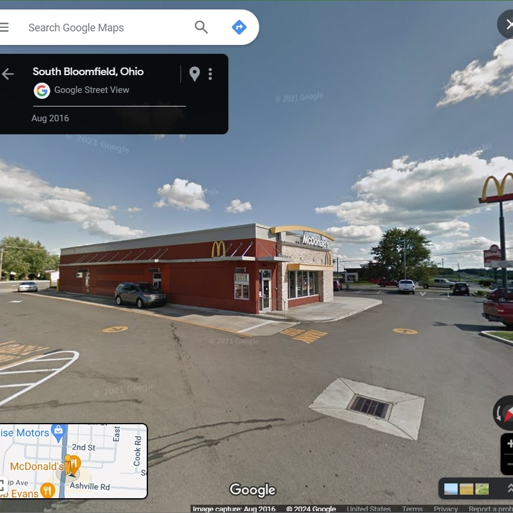

# Physical Pentesting

Physical Pentesting is by far my favorite topic in cybersecurity. I'm not sure if I love it because of the psychology involved or the feeling of being some sort of spy. It all started for me in high school when some people from a healthcare company called Ohio Health came in and gave us a speech on cybersecurity and pen testing. Today we are going to go over some physical pen testing methods that could, hypothetically, work in the field.

## 1. Mapping Entrances and Knowing the Layout
Pretty much the first thing we would want to do is scout out the location where we are doing the pentest. We can use tools like Google Maps, a physical map, and hypothetically, we could try to find a building layout online. Accomplishing this is one of the easiest parts of the physical pentest. So let's set out an actual scenario and go through how we might work through it.
- **The Scenario:**

You are conducting a pentest on the McDonald's in South Bloomfield, Ohio. You are tasked with getting into the manager's office in the back of the kitchen. Scout this location:

While this is fairly easy when you use something like Google Maps you will see that you can get close to the entire building, this is what we want, although we will not always be able to do this, especially if the company is some sort of factory. 
In the below image we will see a basic photo of McDonald's:

If we look at this McDonald's we can see that there is 1 public entrance on the front of the store, 1 public and 2 private (meaning employee only) doors on the right side of the building, and three drive-through windows on the left side of the building. There is not necessarily a floor plan but considering it is a fast-food restaurant you could just walk in and they will probably leave you alone.

We are only scouting but to get in and get the job done, we could see what type of uniform they are wearing and try to get one online, or we could even pretend to be maintenance or something of that nature.

## 2. Lockpicking
This one is pretty self-explanatory. Lockpick is a very good skill to have in this specialized field because not only can it get to where you need to be but it could also help in your day-to-day life. 

## 3. Social Engineering 
This will be the last topic we talk about today even though there are many more. Social Engineering encompasses a lot of different things. I have read stories of a pentester being pregnant and using that to their advantage to pass through doors, people conducting full-on audits while moving about the building installing USB drives and Raspberry PIs. The whole topic is pretty much using human emotions and feelings to your advantage. 

There is a great scene that encompasses this in the show *Mr. Robot*, though this is an exaggeration and merely a TV show, I would like to say that no one should treat someone like this ever, especially during a pentest. 

Thank you all for reading my blog post and come back tomorrow and learn a new topic!

## References
https://purplesec.us/physical-penetration-testing/
https://chat.openai.com/
